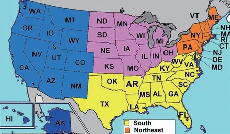

| STATE        | ABBR   | 中文                            |
| -------------- | ---- | --------------------------------|
| Alabama        | AL   | 阿拉巴马州                       |
| Alaska         | AK   | 阿拉斯加州                       |
| Arizona        | AZ   | 亚利桑那州                       |
| Arkansas       | AR   | 阿肯色州                         |
| California     | CA   | 加利福尼亚州                     |
| Colorado       | CO   | 科罗拉多州                       |
| Connecticut    | CT   | 康涅狄格州                       |
| Delaware       | DE   | 特拉华州                         |
| Florida        | FL   | 佛罗里达州                       |
| Georgia        | GA   | 乔治亚州                         |
| Hawaii         | HI   | 夏威夷州                         |
| Idaho          | ID   | 爱达荷州                         |
| Illinois       | IL   | 伊利诺斯州                       |
| Indiana        | IN   | 印第安纳州                       |
| Iowa           | IA   | 爱荷华州（艾奥瓦州）（衣阿华州） |
| Kansas         | KS   | 堪萨斯州                         |
| Kentucky       | KY   | 肯塔基州                         |
| Louisiana      | LA   | 路易斯安那州                     |
| Maine          | ME   | 缅因州                           |
| Maryland       | MD   | 马里兰州                         |
| Massachusetts  | MA   | 马萨诸塞州（麻省、麻州）         |
| Michigan       | MI   | 密歇根州（密执安州）             |
| Minnesota      | MN   | 明尼苏达州                       |
| Mississippi    | MS   | 密西西比州                       |
| Missouri       | MO   | 密苏里州                         |
| Montana        | MT   | 蒙大拿州                         |
| Nebraska       | NE   | 内布拉斯加州                     |
| Nevada         | NV   | 内华达州                         |
| New Hampshire  | NH   | 新罕布什尔州（新罕布夏州）       |
| New Jersey     | NJ   | 新泽西州                         |
| New Mexico     | NM   | 新墨西哥州                       |
| New York       | NY   | 纽约州                           |
| North Carolina | NC   | 北卡罗来纳州                     |
| North Dakota   | ND   | 北达科他州                       |
| Ohio           | OH   | 俄亥俄州                         |
| Oklahoma       | OK   | 俄克拉荷马州                     |
| Oregon         | OR   | 俄勒冈州                         |
| Pennsylvania   | PA   | 宾夕法尼亚州                     |
| Rhode Island   | RI   | 罗得岛州（罗德岛州）             |
| South Carolina | SC   | 南卡罗来纳州                     |
| South Dakota   | SD   | 南达科他州                       |
| Tennessee      | TN   | 田纳西州                         |
| Texas          | TX   | 得克萨斯州                       |
| Utah           | UT   | 犹他州                           |
| Vermont        | VT   | 佛蒙特州                         |
| Virginia       | VA   | 弗吉尼亚州                       |
| Washington     | WA   | 华盛顿州                         |
| West Virginia  | WV   | 西弗吉尼亚州                     |
| Wisconsin      | WI   | 威斯康辛州（威斯康星州）         |
| Wyoming        | WY   | 怀俄明州                         |
